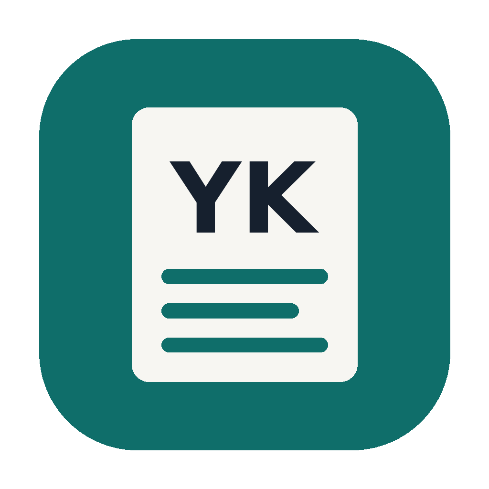

<p align="center"></p>

<h1 align="center">Dịch Tài Liệu Y Khoa</h1>

<p align="center">App cài trên Windows và macOS: dịch tài liệu y khoa PDF tiếng Anh thành file <b>Markdown tiếng Việt</b> dễ đọc.<br>
Chạy được hoàn toàn miễn phí trên máy (Ollama, LM Studio), hoặc qua Gemini API, hoặc giao cho agent như Claude Code.</p>

---

## Tính năng

- **3 cách dịch**
  - **Toàn bộ tài liệu**
  - **Khoảng trang**: `từ trang 10 đến 25`, hoặc nhiều khoảng `1-10, 15, 20-25`. Có thể **chọn theo chương** nếu PDF có mục lục.
  - **Dịch nhanh**: dán một đoạn văn, dịch ngay.
- **Xuất Markdown gọn**: giữ tiêu đề, danh sách, chú thích hình và bảng; bỏ header/footer và số trang; nối lại câu bị cắt qua cột hoặc qua trang, nối từ bị ngắt gạch nối.
- **Dịch có ngữ cảnh**: mỗi đoạn được gửi kèm tên mục và đoạn trước đó, để model hiểu đúng "it", "this"…
- **Kho thuật ngữ**: thuật ngữ trong kho được đưa cho model dùng đúng. Tuỳ chọn ghi kèm tiếng Anh ở lần đầu xuất hiện trong mỗi mục, ví dụ `xương hàm dưới (mandible)`. Bạn tự thêm, sửa và duyệt thuật ngữ trong app.
- **Tự kiểm lỗi**: đánh dấu đoạn thiếu số liệu, sót câu tiếng Anh, dịch ngắn hoặc dài bất thường, sai thuật ngữ đã duyệt, để bạn xem lại.
- **Không mất công khi bị ngắt**: bản dịch được lưu đệm; tắt app giữa chừng thì bấm "Tiếp tục" để dịch nốt phần còn lại.

## Cài đặt (người dùng)

Tải bộ cài ở mục **[Releases](../../releases)**:

| Hệ điều hành | File |
|---|---|
| Windows 10/11 (64-bit) | `DichYKhoa-Setup-x.y.z.exe` |
| macOS, chip Apple (M1–M4) | `DichYKhoa-x.y.z-macos-arm64.dmg` |
| macOS, chip Intel | `DichYKhoa-x.y.z-macos-x86_64.dmg` |

> **Lần đầu mở app:** bộ cài chưa được ký số (cần chứng chỉ trả phí), nên hệ điều hành có thể cảnh báo.
> - **Windows**: SmartScreen báo "Windows protected your PC" → bấm **More info** → **Run anyway**.
> - **macOS**: chuột phải vào app → **Open** → **Open**. Hoặc chạy lệnh `xattr -cr /Applications/DichYKhoa.app`.

### Chọn nguồn dịch (trong app: Cài đặt)

| Nguồn | Chi phí | Ghi chú |
|---|---|---|
| **Ollama** (khuyên dùng) | Miễn phí | Cài [Ollama](https://ollama.com), chạy `ollama pull qwen3:8b` (hoặc model khác), rồi chọn trong app. |
| **LM Studio** | Miễn phí | Bật Local Server trong LM Studio. |
| **Gemini API** | Có gói miễn phí | Cần API key. Gói miễn phí có giới hạn lượt gọi, và Google có thể dùng nội dung gửi lên để cải thiện sản phẩm. |
| **API tương thích OpenAI** | Tuỳ dịch vụ | Mọi dịch vụ có `/chat/completions`. |
| **Agent** (Claude Code…) | Theo gói agent của bạn | App tách đoạn và tạo `AGENT_TASK.md`; agent dịch xong thì bấm "Ghép bản dịch". |

Chọn model theo phần cứng: GPU 6–8 GB thì dùng model 4–8B; GPU 12–16 GB hoặc Mac 16 GB thì 12–14B; GPU 24 GB hoặc Mac 32 GB+ thì 27–32B.
Cách chọn tốt nhất là dán cùng một đoạn vào **Dịch nhanh**, thử vài model rồi so sánh.

### Dữ liệu được lưu ở đâu

- File kết quả `.md`: mặc định trong `Documents/DichYKhoa` (đổi được trong Cài đặt).
- Cài đặt, bộ nhớ đệm, lịch sử, thuật ngữ của bạn:
  - Windows: `%APPDATA%\DichYKhoa`
  - macOS: `~/Library/Application Support/DichYKhoa`

## Giới hạn hiện tại

- **PDF scan (ảnh chụp)** chưa đọc được chữ, vì chưa có OCR. App sẽ báo các trang này.
- Bố cục phức tạp (3 cột, hộp chữ đặt chồng lên nhau, bảng không có đường kẻ) có thể bị xếp sai thứ tự đoạn.
- **Thuật ngữ đi kèm app đang ở trạng thái "Nháp"** và cần người có chuyên môn duyệt. Bản dịch máy luôn cần đối chiếu bản gốc trước khi dùng cho mục đích chuyên môn.

---

## Phát triển

Yêu cầu Python 3.10+.

```bash
# Windows
run-dev.bat
# macOS / Linux
./run-dev.sh
```

Hoặc làm thủ công:

```bash
python -m venv .venv
.venv\Scripts\activate            # macOS/Linux: source .venv/bin/activate
pip install -r requirements-dev.txt
python -m dichyk                  # mở cửa sổ app
python -m dichyk --browser        # mở bằng trình duyệt
python -m pytest -q tests         # chạy test
```

### Cấu trúc

```
dichyk/
  extract.py     PDF → khối (tiêu đề, đoạn, danh sách, chú thích, bảng), thứ tự đọc 2 cột, bỏ header/footer
  pipeline.py    khối → đoạn cần dịch (ngữ cảnh, thuật ngữ) → bản dịch → Markdown; chế độ agent
  glossary.py    kho thuật ngữ TSV + bộ khớp (cụm dài nhất, số nhiều, viết tắt)
  engines.py     Ollama, API tương thích OpenAI
  prompts.py     prompt dịch
  validate.py    kiểm lỗi bản dịch bằng quy tắc
  cache.py       bộ nhớ đệm SQLite
  jobs.py        chạy nền, tiến độ, huỷ, tiếp tục, lịch sử
  server.py      API (FastAPI) cho giao diện
  web/           giao diện (HTML/CSS/JS thuần, không cần build)
  __main__.py    khởi động server + cửa sổ app (pywebview)
kit/termbase/    thuật ngữ đi kèm app (TSV)
packaging/       PyInstaller spec, bộ cài Windows (Inno Setup), icon
.github/workflows/build.yml   build bộ cài Windows + macOS
```

### Phát hành bộ cài

Bộ cài được build tự động trên GitHub Actions, vì bản Windows phải build trên Windows và bản macOS phải build trên macOS:

```bash
git tag v0.1.0
git push origin v0.1.0
```

Workflow chạy test, build `.exe` (Windows) và `.dmg` (macOS Apple Silicon + Intel), rồi tạo Release kèm các file.
Muốn build thử mà không tạo Release: vào tab **Actions** → **Build bộ cài** → **Run workflow**, rồi tải file trong mục Artifacts.

### Giấy phép

App dùng [PyMuPDF](https://github.com/pymupdf/PyMuPDF), vốn theo giấy phép **AGPL-3.0**. Nếu phát hành app cho người khác, mã nguồn app cũng cần công khai theo AGPL-3.0 (hoặc mua giấy phép thương mại của PyMuPDF).
